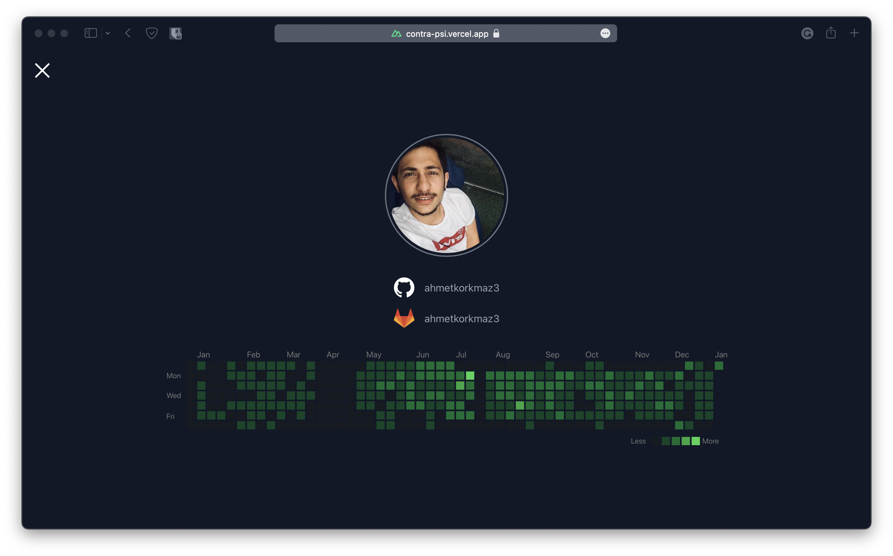

<h1 align="center">Welcome to Contra 👋</h1>
<p>
  
  <a href="#" target="_blank">
    
  </a>
  <a href="https://twitter.com/ahmetmkorkmaz" target="_blank">
    
  </a>
</p>

> Combines GitHub and GitLab contributions calendar to create a single calendar

> Notes: GitLab private repositories are not included. You should enable from profile settings.

### 🏠 [Homepage](https://contra-psi.vercel.app)

### ✨ [Demo](https://contra-psi.vercel.app)

### 🚧 [API](https://github.com/ahmetkorkmaz3/contra-api)

## ScreenShot



## Install

```sh
yarn install
```

## Usage

```sh
yarn dev
```

## Integrate in your GitHub/GitLab profiles.
To integrate contra in your GitHub and GitLab profile simply create a repository called as username in both (i.e. `ZappaBoy/ZappaBoy`).
Then create a `README.md` in the repositories and add a screenshot of contra in your profile. You can automate this action to do screenshots automatically using some services like [thum.io](https://www.thum.io/). You can do that by simply appending the following snippet to your `README.md`:
```markdown

```
For a practical example check both [github.com/ZappaBoy/ZappaBoy](https://github.com/ZappaBoy/ZappaBoy) and [gitlab.com/ZappaBoy/ZappaBoy](https://gitlab.com/ZappaBoy/ZappaBoy).


## Author

👤 **Ahmet Korkmaz**

* Website: ahmetkorkmaz3.github.io
* Twitter: [@ahmetmkorkmaz](https://twitter.com/ahmetmkorkmaz)
* Github: [@ahmetkorkmaz3](https://github.com/ahmetkorkmaz3)

## Show your support

Give a ⭐️ if this project helped you!

***
_This README was generated with ❤️ by [readme-md-generator](https://github.com/kefranabg/readme-md-generator)_
