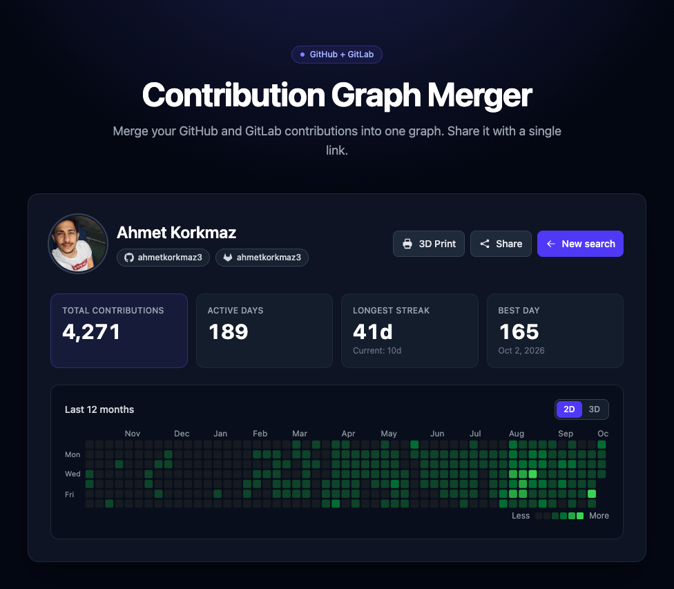
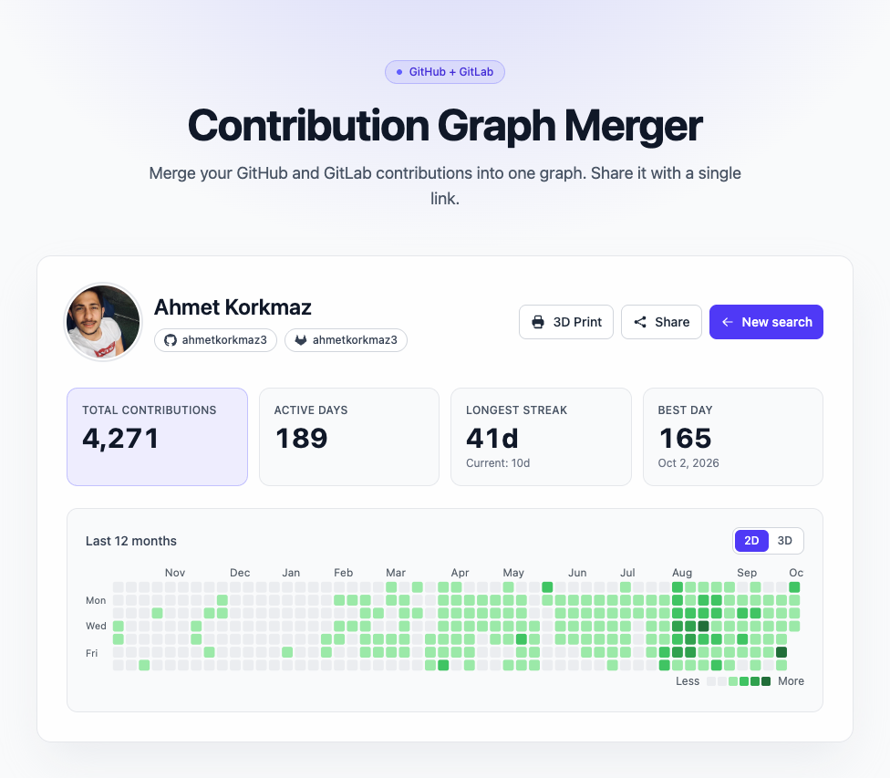
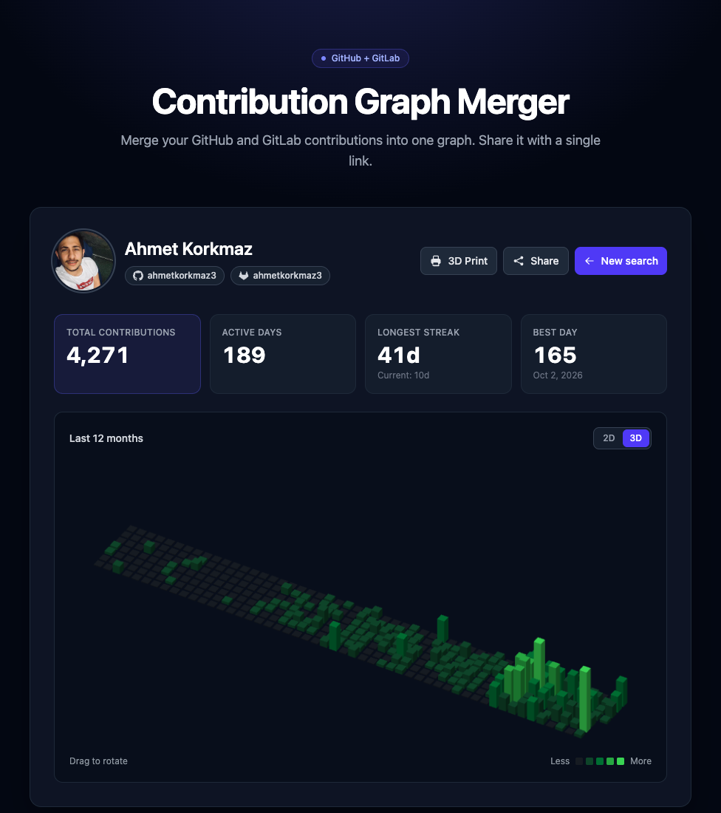
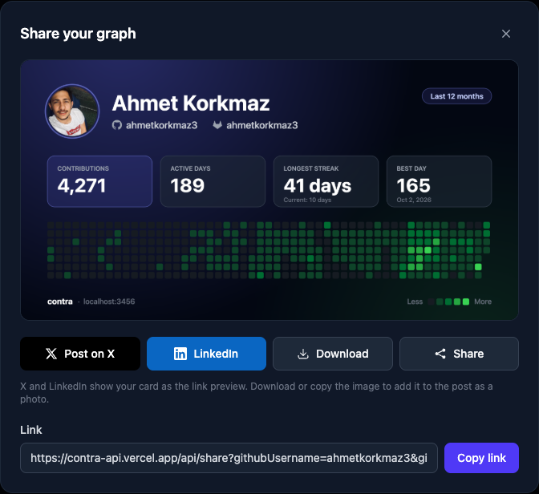
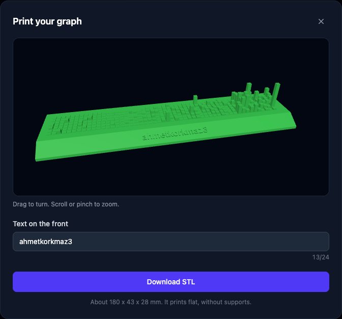
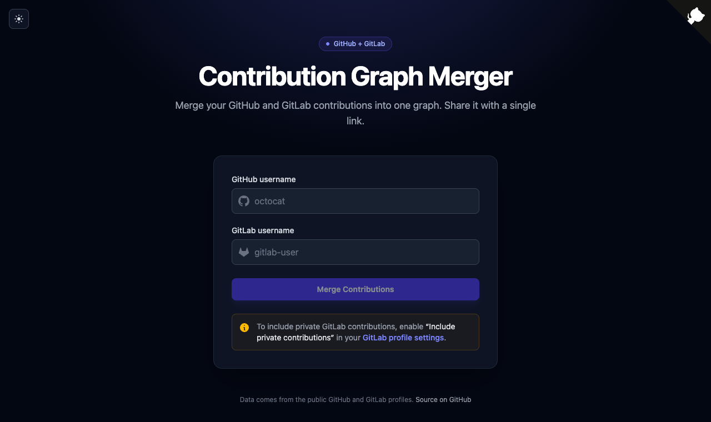

<h1 align="center">Contra</h1>

<p align="center">
  Merge your GitHub and GitLab contribution calendars into one graph.
</p>

<p align="center">
  <a href="https://contra-psi.vercel.app"><strong>Open the app</strong></a>
  ·
  <a href="https://github.com/ahmetkorkmaz3/contra-api">API</a>
  ·
  <a href="#run-it-locally">Run it locally</a>
</p>

<p align="center">
  
  
  
  
</p>

<p align="center">
  
</p>

## Why

Many developers write code on GitHub and on GitLab. Each site shows only its own part of the work. Contra adds the two calendars day by day and shows the total in one heatmap.

## Features

- **One heatmap** for the last 12 months, with GitHub and GitLab added together.
- **Stats**: total contributions, active days, longest streak, current streak, and best day.
- **2D and 3D views.** The 3D view draws each day as a bar. Drag it or use the arrow keys to turn it.
- **Share card.** Download a 1200x630 PNG card, copy it, or post the result to X and LinkedIn with a link preview.
- **3D print export.** Download your year as an STL file of about 180 x 43 x 28 mm, with your name on the front.
- **Light and dark themes.** The app follows the system setting until you choose one.
- **Shareable links.** `?githubUsername=...&gitlabUsername=...` opens the result directly.

## Screenshots

| Light theme                                                     | 3D view                                       |
| --------------------------------------------------------------- | --------------------------------------------- |
|  |  |

| Share card                                               | 3D print export                                                |
| -------------------------------------------------------- | -------------------------------------------------------------- |
|  |  |

<p align="center">
  
</p>

> [!NOTE]
> GitLab shows private contributions only when you enable them. Go to your GitLab profile settings and select **Include private contributions on my profile**.

## How it works

```
Browser (this repo)                 contra-api                    GitHub / GitLab
───────────────────                 ──────────                    ───────────────
Username form  ──GET /contributions──▶  Fetch both calendars  ──▶  public profiles
Heatmap, stats ◀──merged days─────────  Add the counts by day
Share button   ──/share link─────────▶  Open Graph tags + /api/og card for X and LinkedIn
```

This repo holds only the frontend. A separate backend, [contra-api](https://github.com/ahmetkorkmaz3/contra-api), gets the two calendars and merges them. The frontend is a client-only Nuxt 4 single-page app (SPA). It makes the stats, the 3D view, the share card, and the STL file in the browser.

## Run it locally

You need Node `^22.19.0`, `^24.11.0`, or `>=26.0.0`, and Yarn.

1. Install the dependencies:

   ```sh
   yarn install
   ```

2. Copy the environment file:

   ```sh
   cp .env.example .env
   ```

3. Set `NUXT_ENV_API_URL` in `.env` to the base URL of contra-api. For example, `https://contra-api.vercel.app/api`.
4. Start the dev server:

   ```sh
   yarn dev
   ```

5. Open `http://localhost:3000`.

## Scripts

| Command        | What it does                                                    |
| -------------- | --------------------------------------------------------------- |
| `yarn dev`     | Starts the dev server.                                          |
| `yarn build`   | Runs `nuxt generate`. The static output is in `.output/public`. |
| `yarn preview` | Serves the generated output.                                    |
| `yarn test`    | Runs the Node test runner on `tests/`.                          |
| `yarn lint`    | Runs `prettier --check .`.                                      |
| `yarn lintfix` | Runs Prettier on the changed files and writes the fixes.        |

## Tech stack

- [Nuxt 4](https://nuxt.com) and Vue 3, with `ssr: false`, deployed to Vercel
- [Tailwind CSS 4](https://tailwindcss.com) through `@tailwindcss/vite`
- [vue3-calendar-heatmap](https://github.com/razorness/vue3-calendar-heatmap) for the 2D heatmap
- An SVG with its own camera for the 3D view (no 3D library)
- [three.js](https://threejs.org) and [opentype.js](https://opentype.js.org) for the STL export, loaded only when you open the print dialog

## Author

**Ahmet Korkmaz**

- Website: [ahmetkorkmaz3.github.io](https://ahmetkorkmaz3.github.io)
- X: [@ahmetmkorkmaz](https://x.com/ahmetmkorkmaz)
- GitHub: [@ahmetkorkmaz3](https://github.com/ahmetkorkmaz3)

Give the repo a ⭐️ if Contra helps you.

## License

[MIT](LICENSE)
